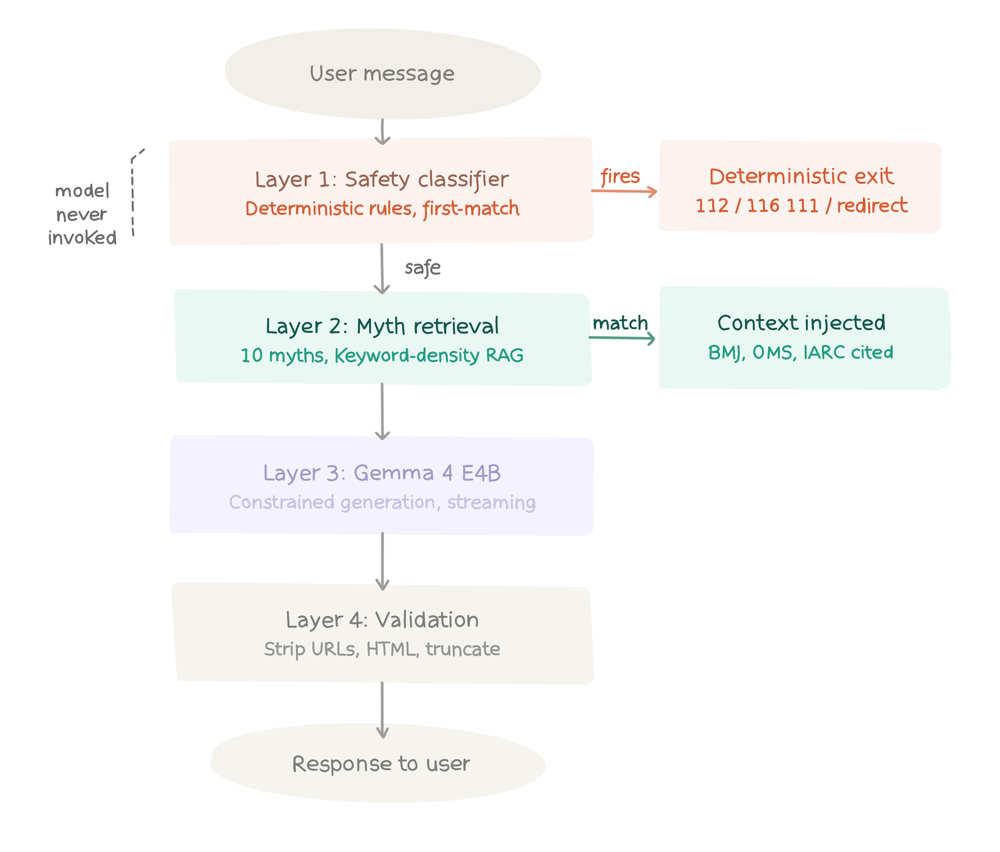

# sensa
Fighting cervical cancer misinformation in Romania with Gemma 4

## The problem
Romania has the highest cervical cancer mortality rate in the EU, yet HPV vaccination uptake remains critically low — driven largely by misinformation spreading unchecked through social media in rural communities. There is no trusted, judgment-free, Romanian-language digital tool where a teenage girl can get accurate answers to the questions she's too embarrassed to ask anyone in her life.

## What Sensa does
Sensa is a conversational health education assistant powered by Gemma 4. It speaks simple Romanian, debunks HPV and cervical cancer misinformation with cited medical sources, and is architecturally designed to run offline on a mobile phone using the E4B model, so a girl like Maria can access it without internet, without a server, and without anyone seeing her search history.

## Architecture

Four-layer pipeline: deterministic safety → myth RAG → constrained Gemma 4 E4B → response validation.

## How to run
1. Open `sensa.ipynb` in Kaggle
2. Attach Gemma 4 E4B model from Kaggle Models
3. Enable GPU T4 accelerator
4. Run All

## Attribution
Sensa is built on Gemma 4 E4B, developed by Google DeepMind.
Sensa is not endorsed by or affiliated with Google.
Gemma is a trademark of Google LLC.
